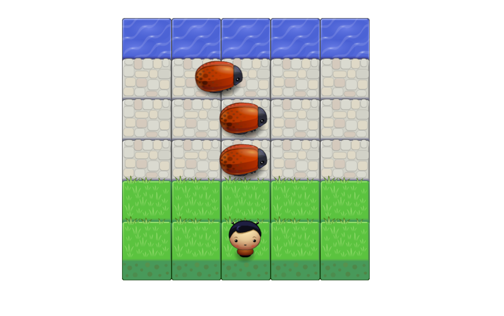

# FroggerArcadeClone
####In Browser
for quick access to the app visit this <a href="http://ericbezanson.github.io/FroggerArcadeClone/">Link</a>
####Local
To run the app locally you will need to use a local server, I suggest installing <a href="https://www.mamp.info/en/">MAMP</a> and while in the console navigate to the htdocs folder within MAMP and run: <pre>git clone https://github.com/ericbezanson/FroggerArcadeClone.git</pre>
######(note: MAMP is just a personal suggestion, any local server will do)

##Functionality
A clone of the classic arcade game Frogger. Use the Arrow keys to move and try and avoid the bugs while making your way to the water. For the best experience play with the console opened :)

##How it Works
The game is using HTML Canvas, supplied sprites, resources and javascript engine via the Front-End Nano Degree couse at Udacity&reg;
######(note: code in the app.js file is my own)

A player class is created with some base attributes and an update, render, detectCollisions and handleInput method using prototype. The inital base attributes determine the players starting position and positions of the various game elements as well as providing the player sprite. The update method checks the players position to see if they are touching the water, thus winning the game. detectCollisions checks to see if the player touched either an enemy or boundry. Player movement is achieved via the handleInput method with a simple switch statement which updates the the x and y position of thr player based on specific keystrokes (arrow keys).

The Enemies object is created with some base attributes and update, movespeed, render, and reset methods. The move speed method sets a random move speed to the move speed property in the Enemy object. The update method multiplies move speed by the dt (time delta between ticks) to ensure smooth performance on all browsers, it also then will move the enemy accross the screen at its assigned move speed. The reset function removes the enemy to just off the page to the left. The render method draws the enemy to the page via the ctx property.

